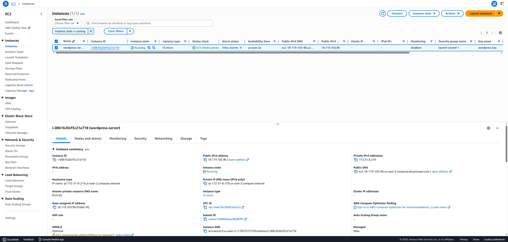
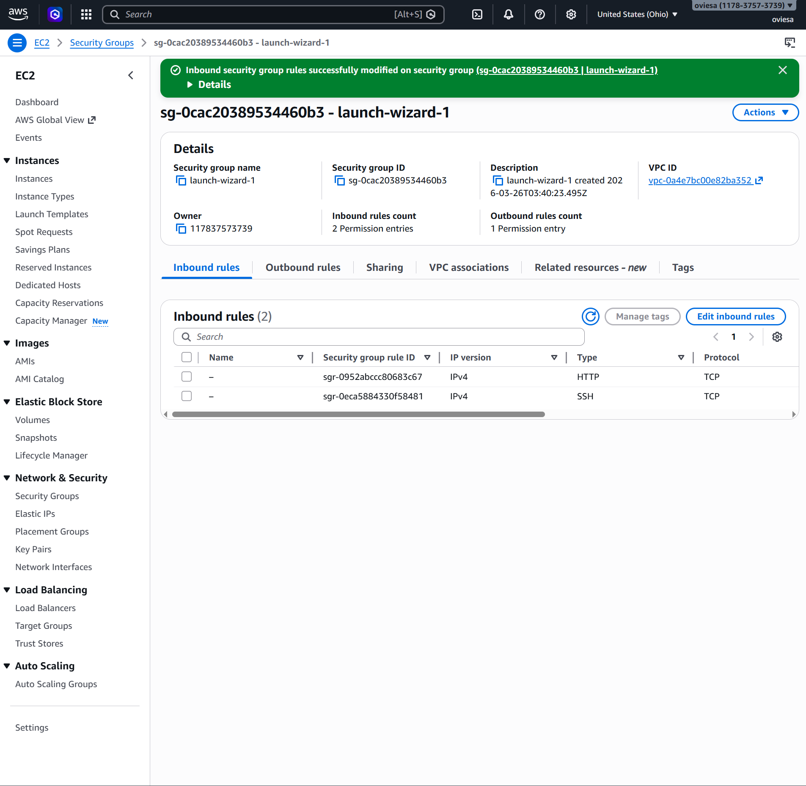
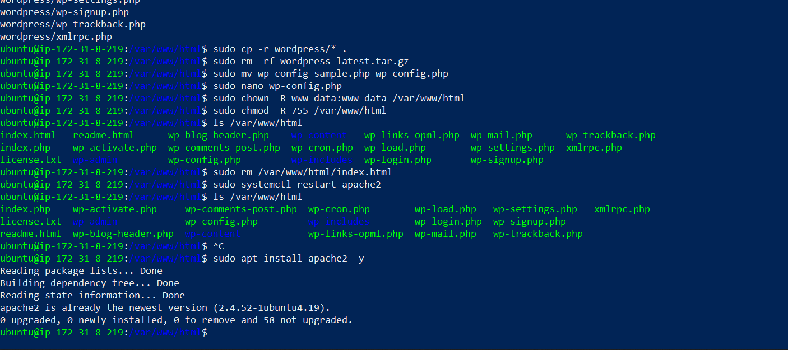
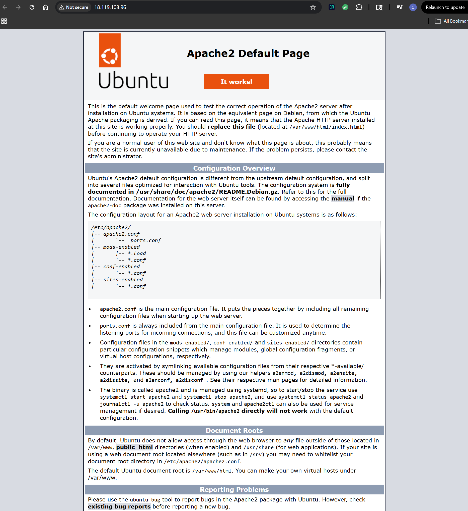
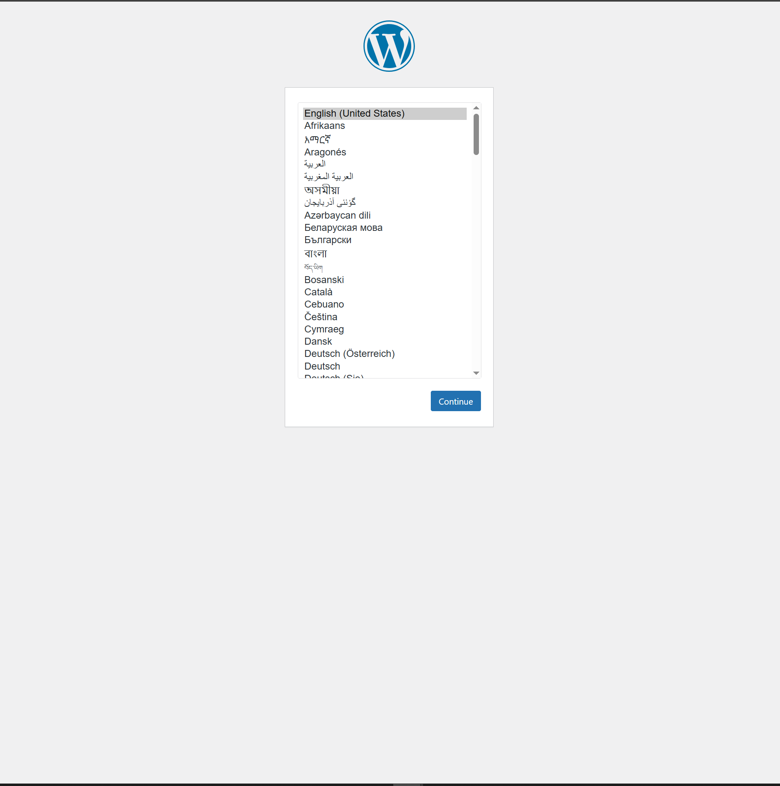
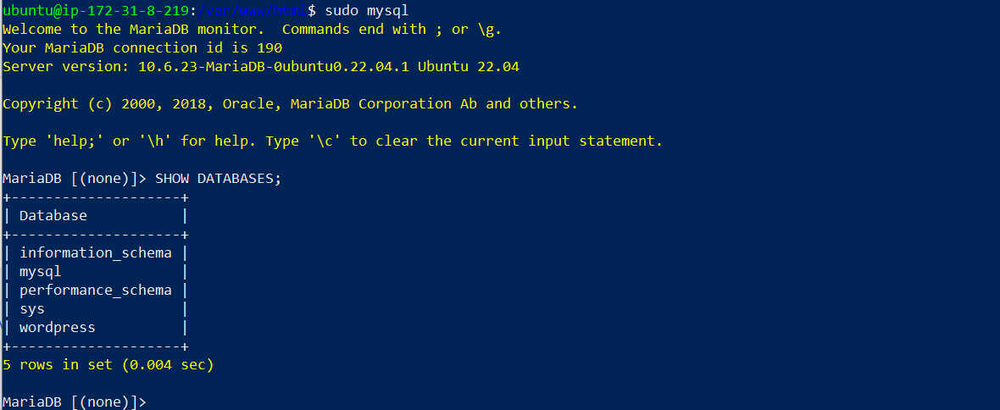
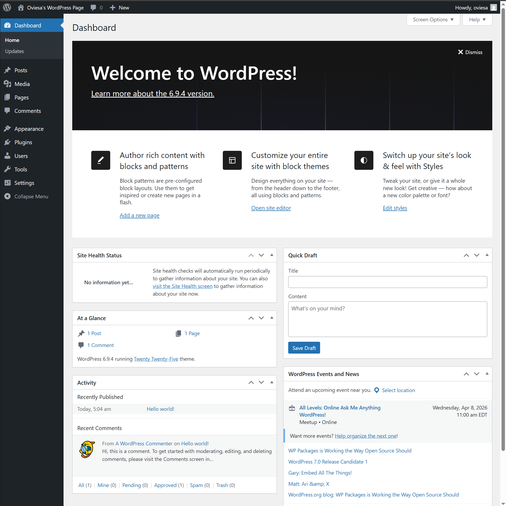
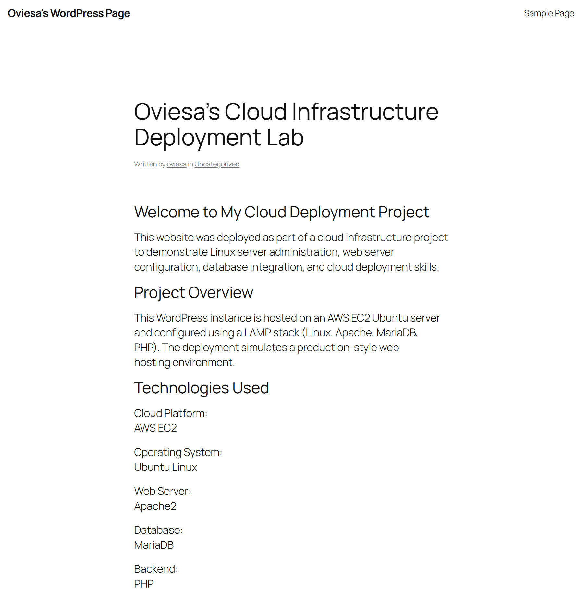
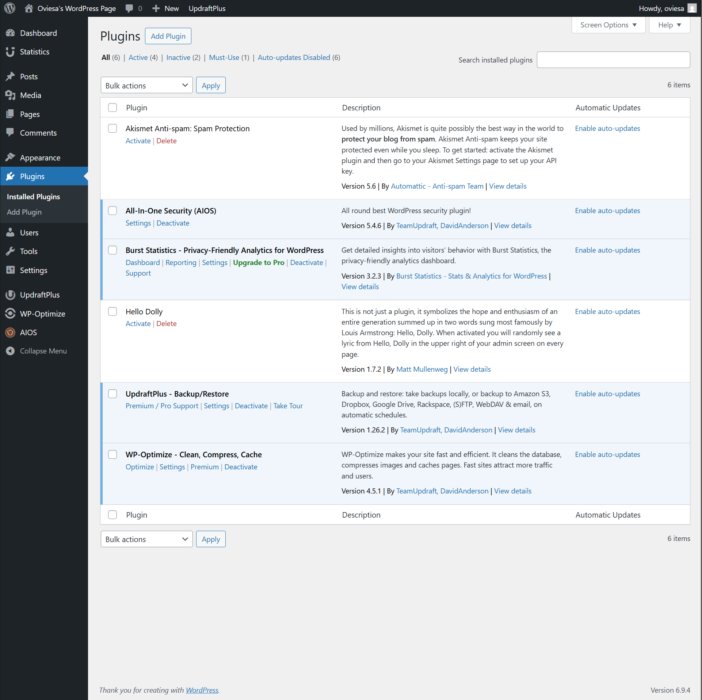

# WordPress Cloud Deployment Project (AWS EC2)

## Overview

This project demonstrates the deployment of a production-style WordPress website on an AWS EC2 Ubuntu virtual machine using Apache, MariaDB, and PHP. The objective was to simulate a real-world Linux web server deployment while gaining hands-on experience with cloud infrastructure, system configuration, and application deployment.

This project demonstrates practical experience in:

• Cloud infrastructure deployment  
• Linux server administration  
• LAMP stack configuration  
• Database integration  
• WordPress deployment  
• Network security configuration  

## Technologies Used

Cloud Platform:
AWS EC2

Operating System:
Ubuntu Linux 22.04

Web Server:
Apache2

Database:
MariaDB

Backend:
PHP

Platform:
WordPress

Tools:
SSH  
Linux CLI  
AWS Security Groups  

## Features

Linux server configuration

Apache web server setup

Database integration with MariaDB

WordPress installation and configuration

Security plugin implementation

Network security configuration

Cloud VM deployment

System troubleshooting

## Architecture

Basic deployment architecture:

User → AWS EC2 → Apache → PHP → MariaDB → WordPress

(Add architecture diagram here later if desired)

## Infrastructure Setup

### EC2 Instance Configuration

### Security Group Configuration

## Server Configuration

### SSH Configuration and Linux Setup

### Apache Web Server Verification

## WordPress Deployment

### WordPress Installation

### Database Configuration

## Application Configuration

### WordPress Dashboard

### WordPress Homepage

### Plugin Configuration

## Installation Steps

### 1 Create AWS EC2 Instance

Created Ubuntu virtual machine  
Configured networking and firewall rules  
Connected via SSH  

### 2 Install Apache

sudo apt update
sudo apt install apache2

### 3 Install MariaDB

sudo apt install mariadb-server

### 4 Install PHP

sudo apt install php php-mysql

### 5 Install WordPress

Downloaded WordPress

Configured wp-config.php

Set file permissions

Restarted Apache

### 6 Configure Security

Installed WordPress security plugin

Configured AWS security group rules

## Challenges Faced

Resolving Linux file permission issues

Configuring Apache correctly

Debugging database connection setup

Understanding cloud networking rules

## Lessons Learned

Linux server administration

Cloud VM management

LAMP stack configuration

WordPress deployment workflow

Infrastructure troubleshooting

## Key Skills Demonstrated

Cloud Infrastructure Deployment

Linux Server Administration

Apache Configuration

Database Integration

Application Deployment

Network Security Configuration

Troubleshooting Production Issues

## Future Improvements

HTTPS configuration (SSL)

Docker container deployment

Automated deployment scripts

CI/CD integration

Monitoring setup

Infrastructure as Code (Terraform)

## Author

Oviesa Oboh

Software Engineer | Robotics Software | Cloud Infrastructure

GitHub: (add link)

## License

This project is licensed under the MIT License.
